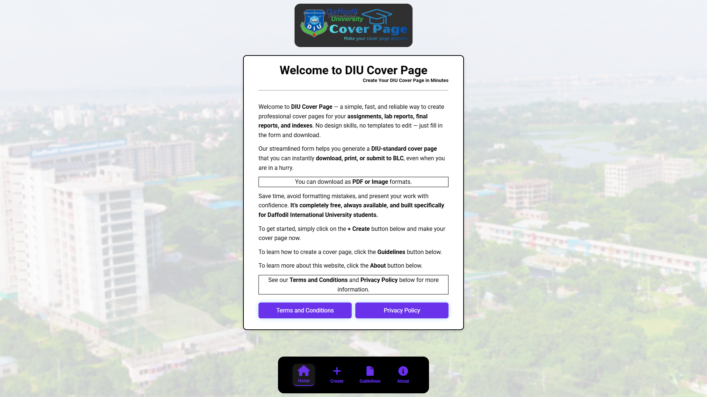

# DIU Cover Page

This repository contains the source code and assets for the DIU Cover Page project. The project aims to provide a customizable and user-friendly cover page solution for Daffodil International University Students.

## System UI

  

## Navigation
- **Home**: Overview of the DIU Cover Page platform  
- **Create**: Tools and options for generating cover pages  
- **Guidelines**: Step-by-step instructions for creating cover pages  
- **About**: Tool overview and author information

## Features

- Academic standard cover page templates
- Responsive design for various devices
- Easy integration and deployment
- Modern UI/UX

## File Structure

- `src/` - Contains the main source code for the application.
- `public/` - Static assets and the main HTML file.
- `README.md` - Project documentation.

Website link: https://diucoverpage.com/