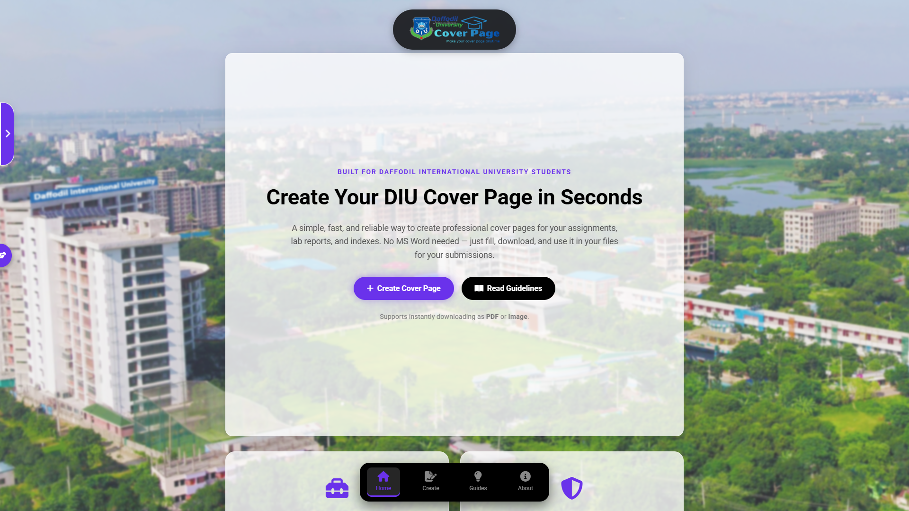

# DIU Cover Page

This repository contains the source code and assets for the DIU Cover Page project. The project aims to provide a customizable and user-friendly cover page solution for Daffodil International University Students.

## System UI

  

## Navigation

- **Home**: Overview of the DIU Cover Page platform
- **Create**: Tools and options for generating cover pages
- **Guides**: Step-by-step instructions for creating cover pages
- **About**: Tool overview and author information

## Features

- Academic standard cover page templates
- Responsive design for various devices
- Easy integration and deployment
- Modern UI/UX

## File Structure

- `404.html`, `index.html`, `privacy-policy.html`, `terms-conditions.html`, `template.html`
- `about/` - About pages, including `index.html` and `contact.html`
- `create/` - Cover page creation pages, including `assignment.html`, `lab-report.html`, `combined-report.html`, `report-index.html`, and `output/output-view.html`
- `guidelines/` - Help and guidance pages, including `index.html`, `faq.html`, `creation-tips.html`, and `blog/index.html`
- `other-tools/` - Extra utilities such as `axis-color-picker.html` and `word-counter.html`
- `assets/css/` - Site stylesheets such as `main.css`, `navbar.css`, `forms.css`, `home.css`, `about.css`, `create.css`, `guidelines.css`, `legal.css`, and `404.css`
- `assets/js/` - Front-end scripts such as `navigation.js`, `engine.js`, `export-handler.js`, `handler.js`, and `survey.js`
- `assets/img/` - UI images and logos used across the site
- `README.md` - Project documentation

Website link: https://diucoverpage.com/
